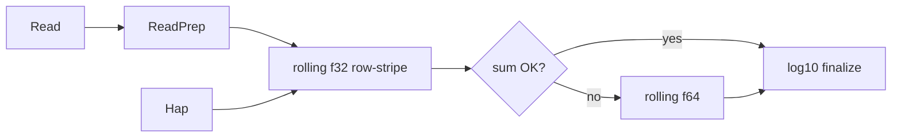

# PairHMM wavefront backend (Architecture C, phase-1)

Opt-in row-wavefront Logless PairHMM for measuring the path to **GKL-class**
throughput. Does **not** change `FASTEST_AVAILABLE` / production default.

## Why hap-axis SIMD is not enough

Criterion on Apple Silicon ([`PAIRHMM_SPEEDUP.md`](PAIRHMM_SPEEDUP.md)):

| hap_count | SIMD vs scalar |
|----------:|---------------:|
| 8 | **0.54×** (slower) |
| 32 / 64 | **~1.4×** |

On GIAB assembly haplotypes, consecutive same-length haps share long prefixes.
The production hap-pack path often **abandons packs** for Java `hapStartIndex`
prefix reuse — so the SIMD axis that Criterion exercises is not the axis that
dominates dense HC wall. Polishing hap-packs cannot reach native GKL PairHMM.

GKL vectorizes **within one (read, hap) DP** (anti-diagonal / wavefront),
typically **f32 + f64 retry**, with OpenMP over independent pairs.

## What this backend implements

| Piece | Choice |
|-------|--------|
| Memory | **Rolling 2 rows** of M/I/D (≡ full-matrix Logless for a single pair) |
| Precision | **f32 primary** with seed `2^120` (fits f32); finalize `log10(sum) − 120·log10(2)`; **f64 rolling retry** on underflow |
| SIMD axis | Within each read-row: **AVX2 8×f32 / NEON 4×f32** for Match + Insertion columns; **Deletion serial** (left dependence) |
| Prep | [`ReadPrep`](../../gatk-haplotypecaller/src/pairhmm_simd/wavefront/prep.rs): transitions + match/mismatch once per read |
| Hot loop | TLS scratch borrowed **once** per hap list; no `RefCell` inside the j-loop |
| CLI | `--pair-hmm WAVEFRONT` (aliases `GKL_STYLE`, `ROW_WAVEFRONT`) |

Scalar [`pairhmm_logless`](../../gatk-haplotypecaller/src/pairhmm_logless.rs) remains the oracle.
Existing hap-axis AVX2/NEON/pack paths remain for A/B.



## Investigations (locked answers)

1. **Rolling rows vs full R×H matrices** — Yes for single-pair / leftover paths.
   Full matrices remain only where `hapStartIndex` prefix reuse needs retained columns
   (hap-pack path). Wavefront uses rolling exclusively.

2. **f32 + f64 retry** — Required for useful SIMD width. Casting `2^1020` to f32 is
   `+Inf` (legacy packed-f32 path effectively always retries). Wavefront uses
   `INITIAL_CONDITION_F32 = 2^120` so the scale factors out of the Logless score.

3. **Batching** — HC shape is one read × N haps with shared prep. Criterion also
   measures read×hap tiles (prep per read, sequential kernels) to separate prep
   amortization from kernel throughput. Rayon-over-reads stays outside the kernel.

4. **True GKL anti-diagonal** — Not in phase-1. Row-stripe still serializes D and
   does not fill lanes from independent anti-diagonal cells. That remains the
   primary remaining gap to GKL-class cell throughput.

## Prove

```bash
cargo test -p gatk-haplotypecaller --test pairhmm_wavefront_vs_scalar_test --locked
cargo test -p gatk-haplotypecaller --test pairhmm_simd_vs_scalar_test --locked

# Apple Silicon (NEON) or Linux AVX2 host:
cargo bench -p gatk-haplotypecaller --bench pairhmm --locked -- pairhmm_wavefront
```

Fair Java/GKL comparison: same synthetic 1×N / tile matrix on an AVX2/AVX-512 host
per [`PERF_BENCHMARK_HOST.md`](../ci/PERF_BENCHMARK_HOST.md). Do not invent GKL
numbers — fill a run table under `docs/perf/runs/` when measured.

## Remaining gaps to GKL-class throughput

- True **anti-diagonal** SIMD (cells on `i+j` wavefront)
- **AVX-512** 16×f32 backend
- **OpenMP-analogue**: Rayon over (read,hap) pairs with per-thread scratch (HC already Rayon-over-reads)
- Deletion **still serial** in row-stripe → limits lane efficiency
- Hap-axis prefix reuse cell savings (orthogonal; keep until wavefront wins TRACE)

## Production wiring

Do **not** put wavefront into `FASTEST_AVAILABLE` until:

1. `pairhmm_wavefront_vs_scalar_test` green
2. Product TRACE δ on wall-losers
3. F1 / holdout gates unchanged
